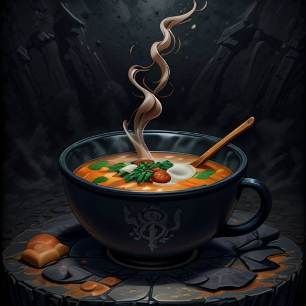

# SnackMentor
An application that makes it easier to carry out a personalized diet on a daily basis. \
It will take care for all of the tedious calculations and preparations for you.

# Current Phase
Strategic Planning, Deciding between anemic and rich domain model. \
Sorry for keeping it in near abandoned state but I want to do it right. \
Learning takes time, be patient............

# Planned functions

- Adding custom ingredients/products, dishes/meals, recipes, plans
- Sped up process of adding products based on existing ones
- Converting between different units like grams, cups, ounces, etc.,
- Ability to use both built-in database of products and custom ones
- Calculating calories and macronutrients
- Calculating micronutrients and pointing out possible deficits or exceeding the norms
- Ability to personalize micronutrients norms
- Suggesting calories needs based on body parameters
- Pointing out allergens
- Identification of food additives, their technological functions and harmfulness
- Adding chosen products/meals/etc. to favourites
- Blacklisting unwanted ingredients and/or meals
- Sharing meal plans with friends
- Automatic creation of shopping lists based on meal plans
- Tracking diet progress
- Daily tips about health
- Printing custom plans, recipes etc.
- And much more...